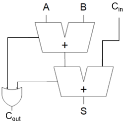

# HW 6 - Digital Schematics

The intent of this HW is to teach you how to draw and simulate digital logic schematics.

## Download Digital

1. Download [Digital](https://github.com/hneemann/Digital) from GitHub.
2. Unzip Digital and copy the entire unzipped it to someplace convenient.
3. You don't actually need to install Digital; you can just run the `Digital.exe` by double clicking on it.
4. You may be prompted to install Java. Please do so and then try running digital again.

## Half adder, again

Let's revisit the half adder!

1. Run Digital
2. Click File > New embedded Circuit
3. In the window that opens, create a half adder!
    - Components > IO > Input
    - Components > IO > Output
    - Components > Logic > AND
    - Components > LOGIC > XOR
4. Connect everything with wires. For example, click the red dot on the right side of one input, then click the blue dot on the left side of a logic gate. While dragging a new wire you can click on the grid to make it turn 90 degrees. You can also click on an esxisting wire
to start a wire from that point. A dot (solder joint) on two wires shows that they are connected at that dot!
5. Right click on each of the inputs and outputs and give them a Label (`i_A`, `i_B`, `o_S`, and `o_Cout`).
6. File > Save As and name your file **halfAdder.dig**

You can now simulate the circuit to see if it works as expected.

Simulation > Start of Simulation or the play button in the center tool bar.

Then click inputs to see if outputs behave as expected!

Close the halfAdder window.

## Full adder

To make a full adder we are going to connect two half adders!

**First**, read the [ICE3 Background](https://usafa-ece.github.io/ece281-book/ICE/ICE3.html#background) section to learn what a full adder is and how to make it with two half adders.

1. **After** reading the background section, return to your open Digital window. It's blank.
2. Instead of making a half adder all over again, go Components > Custom > halfAdder !
3. Do that again to get your second half adder.
4. Add an OR gate
5. Add inputs and outputs
    - Cin
    - A
    - B
    - Cout
    - S
6. Connect everything like this - but the pants are your halfAdder component.

7. Start simulation and test! It should match the [full adder truth table](https://usafa-ece.github.io/ece281-book/ICE/ICE3.html#full-adder-truth).
8. Save your final schematic as **fullAdder.dig**

Later, when we build this in VHDL we will connect switches and LEDs to the inputs and outputs, respectively.

## Submission

Zip both halfAdder.dig and fullAdder.dig and upload to the gradescope assignment.
