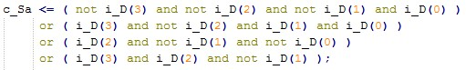
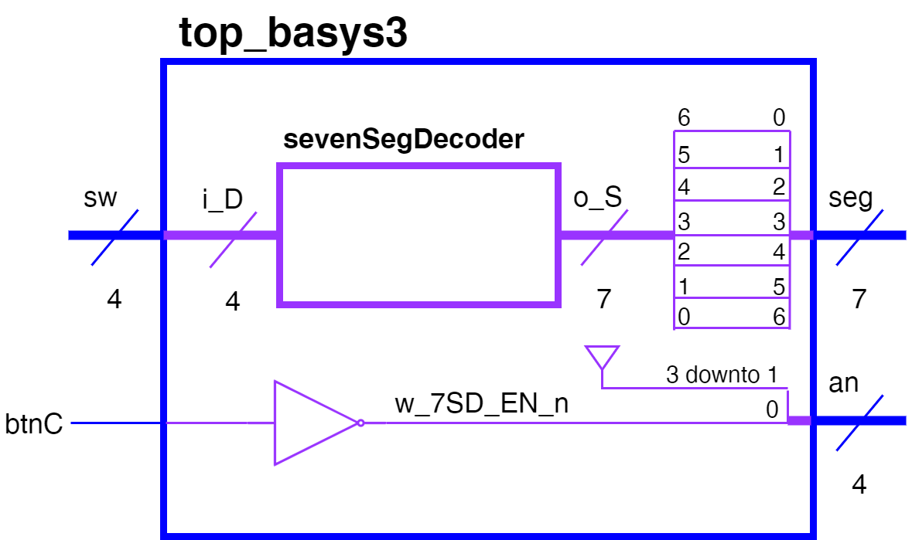
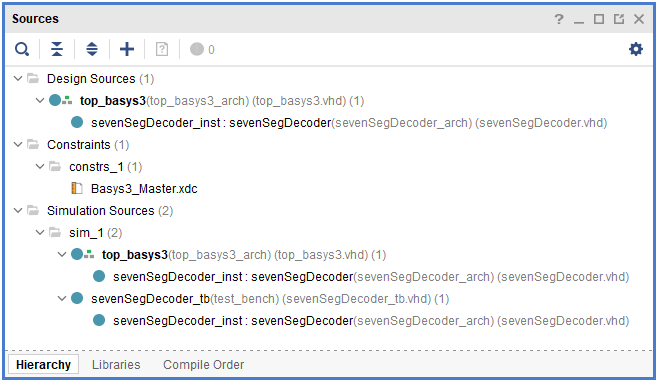

# Lab 2 - Seven Segment Display Decoder

Due: Lesson 17

```{contents}
:local:
:depth: 2
```

## Overview

In this lab you will implement the
[seven-segment display](https://en.wikipedia.org/wiki/Seven-segment_display) decoder
in VHDL to display a hexadecimal digit. The hex digit will come from a
hardware-based binary to hex converter, which you will develop.

A four-bit value will be input using switches.
Upon pressing the center button, a seven-segment display will
output the correct hex digit, {numref}`hex-of-switch`

```{figure} img/lab2_image1.jpg
---
name: hex-of-switch
---
Binary-to-hex displayed on seven-segment display
```

### Objectives

1. Develop a hardware-based binary to hex converter
2. Display switch value on seven-segment display

### Supplies

- Basys3 board

### Collaboration

Your instructor will inform you if you can work in pairs or not. For all assignments in this course, unless
otherwise noted on the assignment, you may work with anyone. We expect
all graded work, to include code, lab notebooks, and written reports, to
be in your own work. Copying another person's work, with or without
documentation, will result in NO academic credit. Furthermore, copying
without attribution is dishonorable and will be dealt with as an honor
code violation.

## Background

When creating simple embedded digital designs, a seven-segment display
is a common way to display numbers or simple letters to the end-user. In
this lab, you will design a seven-segment display decoder. This decoder
takes a 4-bit binary input, and produces 7 bits that indicate whether
each "segment" of the display is **on** (`0`) or **off** (`1`).

There are seven "segments" (labeled a -- g, see {numref}`7seg-label`) and one decimal point
(we will ignore the d.p. in this lab) in a seven-segment display.

```{figure} img/lab2_image2.png
---
name: 7seg-label
---
Labeled segments in display
```

On our Basys3 board an anode determines which of the displays are on,
while cathodes allow you to turn on each individual segment,
{numref}`7SD-anodes`

```{figure} img/lab2_image18.jpg
---
name: 7SD-anodes
---
Basys3 7SD cathodes and anodes.
```

Said differently, you disable an entire display by connecting it to power, aka `1`.

Placing a `0` on a segment will cause it to light up, while a `1` will keep the segment dark.
This is called "active low."
For example, to display the number "0", a logic `0` must be placed on segments `a`-`f`,
while segment `g` will be a logic `1`.

In this way, you can display every hexadecimal digit:
"0" - "F" as shown in {numref}`7SD-digits`

```{figure} img/lab2_image3.png
---
name: 7SD-digits
---
Hexadecimal digits on a seven-segment display
```

## Pre-lab

First, complete the truth table for converting binary inputs to a hex output on the display.

Excel template is available on Teams!

Second, use this truth table to generate logic equations for each output.

## Lab

Now that you have Boolean equations established for each of your seven
segment outputs, it is time to implement them in hardware with VHDL!

### Setup Vivado Project

Due to issues with the automated build process in ICE3, we recommend manually creating a
Vivado project and then adding the source files manually.

1. Accept the assignment and clone the newly created repository
2. Open Vivado
3. Follow instructions in {ref}`create-new-vivado-project`. Suggested project name is **binaryHexDisp**
4. Follow instructions in {ref}`manual-add-to-vivado-project` to add everything in `src/hdl/` to your project
5. Ensure your source hierarchy looks like you expect.

> Edit the file headers as necessary. Then commit your changes with git.

### Top-level file

The functionality we are looking for is this:

```{mermaid}
flowchart LR
    binary([4-bit input]) --> hex[Convert to hex]
    hex --> button{Display active?}
    button --> out[Display hex output]
```

We have opted to use switches for our input and the seven segment display as our output.
A button press will activate the display.

In order to make this happen we need to use a top level design to wire our inputs and outputs
as well as some internal logic.
We will make the seven segment display an internal component - like we did with the half-adder in ICE3 -
since it is more complex and should be tested independently.

The repository you cloned and built has a top-level file already defined.
The schematic is shown in {numref}`7SD-top-level-schem`.

```{warning}
This diagram is mislabeled. Do not invert the vector between `o_S` and `seg`.
Just like your truth table, `s_G` should be the MSB.
New picture will be posed soon.
```

```{figure} img/lab2_image19.png
---
name: 7SD-top-level-schem
---
Top-level schematic
```

You need to connect your 7SD component to four physical switches (sw)
and the seven cathodes (seg) of a seven-segment display (7SD).
Also wire a push button (btnC) to activate the 7SD by sending a **low signal** to the anode.
Since the button itself is active-high, an inverter is required.

The entity is provided for you, but you must complete the architecture.

```{note}
The entity interface has been designed so that the port names match exactly
what the constraints file (`Basys3_Master.xdc`) is already using.
```

#### A note on <= vs. =>

When connecting an input to a wire, the input must be on the right side.

In the below statement, `btnC` is the input and `w_7SD_EN_n` is
the wire connecting the button to the 7SD active-low enable pin:

```vhdl
w_7SD_EN_n  <= not btnC;
```

In this case, `<=` is an **assignment statement** and connects the button to a wire.

To connect the other end of the wire and enable the (anode) pin, you have to
use an `=>` because the `=>` is used for **case statements**, **array assignments**,
and component **port mapping**.

```vhdl
an  <= (0 => w_7SD_EN_n, others => '1');
```

In the above statement, the signal an is an *output*, so it must be on the left side.
We declared `an` earlier as a 4-bit vector. The right side is using the `()` aggregate operator
to concatenate bus signals; in this case, the LSB is assigned to `w_SD_EN_n`.
The keyword "others" refers to any bus signals not otherwise explicitly listed,
so it sets the other three bits to `1`.

Another way to describe the above connections is as follows:

```vhdl
an(0)    <= w_7SD_EN_n;
an(1)   <= '1';
an(2)   <= '1';
an(3)   <= '1';
```

> Follow the comments in `top_basys3.vhd` to complete the architecture.

### Seven Segment Display Decoder

For better modularity, we will implement our seven segment display decoder as its own component.

We have provided a template file in Teams under **Files > Handouts and Resources > Templates**.

1. Save a copy of ECE_template.vhd as a file named **sevenSegDecoder.vhd** into your Lab2 `src/hdl/` folder.
2. Save a copy of ECE_template_tb.vhd as a file named **sevenSegDecoder_tb.vhd** into your Lab2 `src/hdl/` folder.
3. Add your sources to Vivado. Remember to leave "Copy sources into project" **unchecked**. See {ref}`manual-add-to-vivado-project`

Edit the file headers as needed.

1. Find and replace all instances of "ECE_template" with `sevenSegDecoder`
2. Within Vivado, open one of your VHDL files and then type `CTRL+SHIFT+R` or click on Edit→Replace in Files
3. Fill in the find and replace text boxes as required. Make sure to check all of the sources you want to change:


In the message area (bottom of Vivado screen) click "Replace All"


### 7SD Entity

How do we determine which should be out most signifigatn bit (MSB): $Sa$ or $Sg$?
Fundamentally, **we want to adhere to the constraints file.**
Referencing [Basys3 I/O](https://digilent.com/reference/basys3/refmanual#basic_io) *(this is a great page to know about!!!)*
and comparing it to **Basys3_Master.xdc** we can see that:

- The pin `W7` is connected to cathode `CA`, which we have called `sA`.
- .xdc shows `PACKAGE_PIN W7 [get_ports {seg[0]}]`, so **`sA` is the LSB**
- The pin `U7` is connected to cathode `CG`, which we have called `sG`.
- .xdc shows `PACKAGE_PIN U7 [get_ports {seg[6]}]`, so **`sG` is the MSB**
- This already corresponds with how our Prelab truth table is organized!

> Create your interface (ports) for your sevenSegDecoder according to {numref}`7sd-entity-arch`

```{warning}
This diagram is mislabeled. c_Sa should be 0 and c_sG should be 6. New picture will be posed soon.
```

```{figure} img/lab2_image9.jpg
---
name: 7sd-entity-arch
---
sevenSegDecoder entity and architecture
```

The interface for the sevenSegDecoder entity is shown in blue and the architecture in purple.
The input, `i_D`, is a bus of four wires.
The output, `o_S`, is a bus of seven wires.

This can be created in VHDL by using a **std_logic_vector** signal type.
For instance, `i_D` could be created in the **port** statement with the following:

```vhdl
i_D : in std_logic_vector(3 downto 0)
```

Remember, the `i_` follows the naming convention provided in the header
that indicates the signal is an input. The statement above `3 downto 0`
indicates that BIT3 is the MSB and BIT0 is the LSB. You could easily
reverse this by swapping the locations of the two numbers.

To access each wire from the bus you created simply refer to the bit
number in parentheses. For instance, `i_D(3)` refers to the MSB of the
input, D.

### 7SD Architecture

After you have created your component interface, you need to describe
the architecture. {numref}`7sd-entity-arch` shows that the output of
the combinational logic produces a signal for each 7SD segment (`c_Sa` ...
`c_Sg`). These combinational signals (denoted by the `c_` at the
beginning) are wired to each bit of the output segment bus (`o_S`). The
bit numbers are labeled in the diagram. For instance, `BIT0` of `o_S` is
wired to `c_Sa`.

- For clarity, declare intermediate combinatorial signals (e.g., `c_Sa`) that break out output `S` and set them to a default value of `1` (off). This should be done *before* **begin**.
- There are no PORT MAPS or PROCESSES needed for this module, so you can delete those sections.
- In the CONCURRENT STATEMENTS section, map the output `S` to the signals you created above. For instance:

```vhdl
o_S(0) <= c_Sa;
```

#### Behavioral vs. Structural modeling

There are two basic philosophies for modeling digital architectures:

- **structural** describes *how* the module would be composed as a hierarchy of simpler modules.
- **behavioral** describes *what* the logic does in terms of inputs and outputs.

We will be using behavioral modeling in this lab.

For instance, you could derive the simplified Boolean expression:

$$
Sa = (D3')(D2')(D1')(D0) + (D3)(D2')(D1)(D0) + (D2)(D1')(D0') + (D3)(D2)(D1')
$$

This could then be implemented *behaviorally* with the following VHDL
code:



Notice that the logic for the intermediate signal `c_Sa` is described in
terms of AND, NOT, and OR gates. Also notice that the statement spans
multiple lines and is ended by a semicolon. It is helpful to break
statements like this into multiple lines so that they are easier to
read. Each implicant from the simplified Boolean expression has its own
line and is surrounded by parentheses (use SPACE to make it more
readable).

There are many ways to describe a behavioral model, however. Contrast
the above behavioral model with the following one:


The behavioral model describes the logic just like the truth table. In
this case, it essentially creates a lookup table (LUT) where the '1's
are identified, and everything else is '0'. Note, how using a
**std_logic_vector** for `i_D` allows us to compare the input to a 4-bit
hex value(denoted by the 'x') instead of comparing all of the individual
bits. This is one of the advantages of using that signal type.

> Now that you have an understanding of how to implement behavioral models
> in VHDL, implement all seven of your outputs for sevenSegDecoder.

- Use behavioral modeling with AND, NOT, and OR gates for at least two of them.
- Use behavioral modeling with a LUT for at least two of them.
- Which model method do you think is easier to use for implementing your outputs?
- Implement the remaining outputs with your preferred choice.

### Test sevenSegDecoder

If you skipped the part above about bringing in the **ECE_template_tb.vhd**,
do it now.

1. Copy in the port information for your sevenSegDecoder component.
2. Declare a bus (std_logic_vector) or series of signals for the switch inputs.
3. Declare a signal vector to connect to the segment outputs (e.g., `w_seg`) from your component
4. Port map your component instance to the wires you creates for the
    switches and the 7SD segments.

```{tip}
The keyword **OPEN** can be used if you prefer to not wire a port to
something (e.g., you will read or manipulate the ports directly in
your simulation)
```

5. Create your test plan process. Remember, you can use hex values with
    busses, such as `sw <= x"F"`.
6. Add enough assert statements to cover the truth table.
7. Fix any syntax errors, and run the simulation.

If **sevenSegDecoder_tb** is not set as the top of your simulation hierarchy,
right click on it and choose "Set as top."

> Make sure the simulation results match your Prelab truth table, and
> then **take a waveform screenshot for your report**.

```{hint}
You may need to reverse the order to make your sim match the truth table:
(right click-\> Reverse Bit Order).
```

### Complete top level

The top level VHDL file is what connects your component to the Basys3
development board. {numref}`7SD-top-level-schem` is shown again below.

```{warning}
This diagram is mislabeled. Do not invert the vector between `o_S` and `seg`.
Just like your truth table, `s_G` should be the MSB.
New picture will be posed soon.
```



As can be seen in the figure, you need to connect your 7SD
component to four physical switches (`sw`) and the seven cathodes (`seg`) of
a seven-segment display (7SD).

You also need to wire a push button (`btnC`) so that it can be used to activate the 7SD by sending a **low signal** to the anode. As discussed in the Background {numref}`7SD-anodes` the anode determines which of the displays are on, while the cathodes allow you to turn on each individual segment.

Since the button itself is active-high, an inverter is required. The
other 7SDs (display 3, 2, and 1) are disabled by connecting them to
power.

```{note}
The entity interface has been designed so that the port names match exactly what the constraints file (Basys3_Master.xdc) is already using.

You simply need to uncomment the lines in Basys3_Master.xdc that you need to use.
```

> Use the provided top_basys3.vhd file to complete the top level architecture.

After you finish, your source hierarchy should look something like this:



#### Implement in hardware

Synthesize and implement your design.

> Look at the RTL schematic:
> In RTL Analysis in the Flow> Navigator on the left side of the window.

- Is this what you expect? Did Vivado implement the circuit like you thought it would?
- Double click on the sevenSegDecoder component. Did Vivado implement
    the circuit like you thought it would?

Generate the bitstream (.bit) file and download it to your FPGA.
Verify the hardware functions as expected; **demo to your instructor**.

> Commit the bitstream to your repo

## Deliverables

Below are the deliverables and point distributions for the Lab 2:

| Deliverable           | Points |
|-----------------------|--------|
| Prelab                | 15     |
| Hardware Demo         | 30     |
| Written Report        | 30     |
| Passing GitHub Action | 25     |

**Documentation statements** will be in the README for any help on the code files.
Otherwise, the statement will be submitted on Gradescope (for the prelab and report).

### Prelab

See instructions at the top of this lab.
Submit on Gradescope.

### Hardware demo

- You have to hold the center push button down for a 7SD to show your output. (10 pts)
- The correct hex digit is shown based on the switch positions for all input possibilities. (20 pts)

Demo can be performed live with an instructor (preferred) OR submitted via Teams

### Written Report

Rubric and template on Teams. Submit on Gradescope.

### Git and GitHub Actions

- sevenSegDecoder.vhd, sevenSegDecoder_tb.vhd, and top_basys3.vhd included in `src/hdl/`
- Extraneous comments are removed and code is formatted in a sane manner
- Basys3_Master.xdc file included in `src/hdl/`
- Bitstream (.bit) file used for hardware demo in repo (in default location)
- Include a `## Documentation` section in the README
- Commit messages are useful in tracing the development of the project
